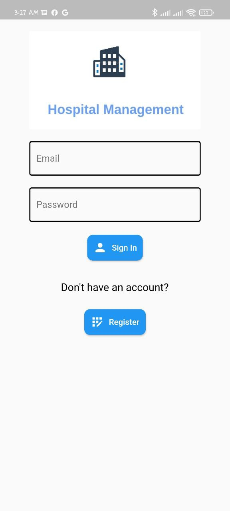
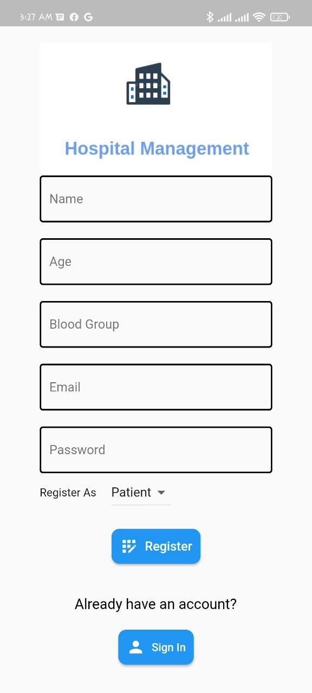
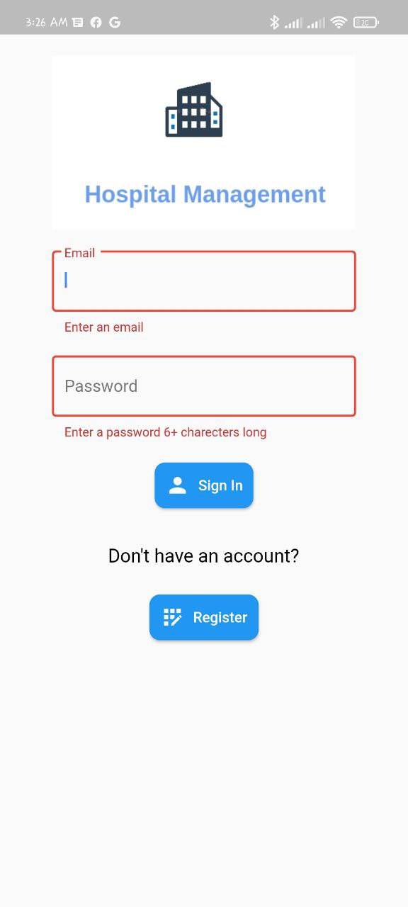
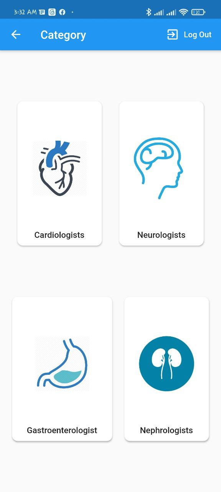
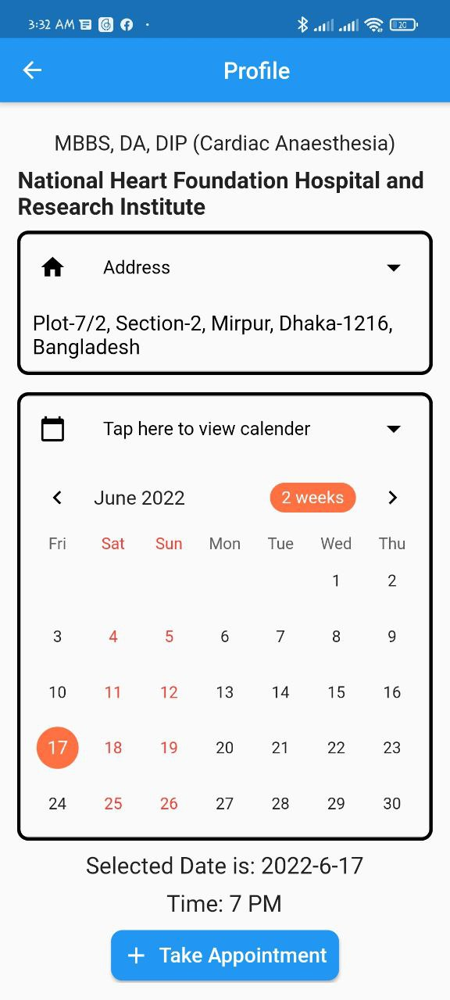

# Doctor's Appointment Taking App
#### Welcome 🤞 To Doctor 👨‍⚕️ Appointment Taking Application  
#### APK Download [Link](https://drive.google.com/drive/folders/1oPCzNIeDbqcLwql2E3J88let9olGWe_a?usp=sharing)

#### Implementation Details
- Implemented auth service 🔓 for user registration and authentication using Firebase Authentication 
- Implemented form validation ✅
- Used the cloud firestore database for storing 🏪 doctor's information
- Implemented a database service for retriving data from cloud firestore 🔥
- Used the provider package for user state management 
- Used a calender 📅 package for date input from user and validate the input
- Implemented a mail 💌 service for sending emails to user email address when anyone takes appointments

> Note: This application is developed as a part of my android application development course. Also I have added new features to this application to serve as a hospital management system. Feel free to ask [me](https://t.me/shuvokkr) anything about this project.

#### Demo Screenshots
##### User Sign-in & 

#### User Register Page

#### User Input Validation

#### User Type

#### Doctor Category

#### Doctor List

#### Doctor Profile
